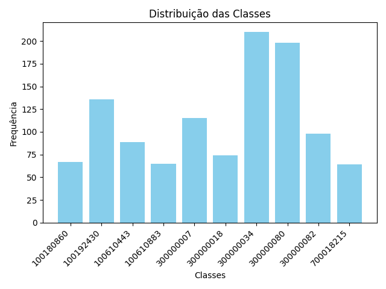
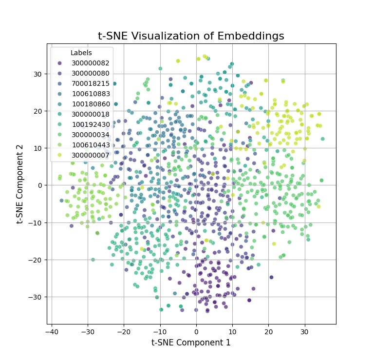
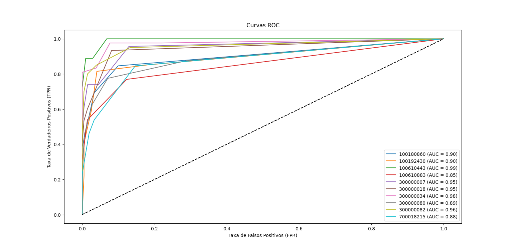
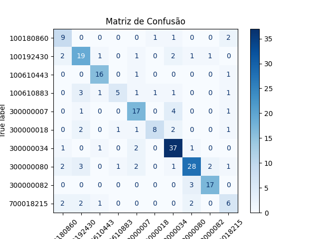

# Projeto Apollo-Challenge
Este projeto tem como objetivo aplicar métodos de aprendizado de máquina para análise e visualização de dados. Utiliza técnicas de similaridade (cosseno e euclidiana), avaliação de modelos (AUC e precisão), processamento de dados, visualização e t-SNE para redução de dimensionalidade. O código está dividido em módulos com funções específicas para cada tarefa, permitindo uma estrutura modular e reutilizável.

## Estrutura do Projeto

```
apollo-challenge/
│
├── src/
│   ├── __init__.py
│   ├── data_processing.py
│   ├── data_visualization.py
│   ├── evaluation_metrics.py
│   ├── results_saving.py
│   ├── similarity_metrics.py
│   ├── tsne_processor.py
│   └── visualization.py
├── test/
│   ├── __init__.py
│   ├── test_data_processing.py
│   ├── test_data_visualization.py
│   ├── test_evaluation_metrics.py
│   ├── test_results_saving.py
│   ├── test_similarity_metrics.py
│   ├── test_tsne_processor.py
│   └── test_visualization.py
├── main.py
├── README.md
└── requirements.txt
```

## Descrição dos Módulos

### 1 - **main.py**:
- Contém o fluxo principal do programa, desde o carregamento e processamento dos dados até a avaliação do modelo.
- Carrega dados, executa pré-processamento, avalia similaridades usando distância cosseno e euclidiana, gera as métricas de avaliação e cria visualizações como curvas ROC e matrizes de confusão.
- Chama funções de módulos auxiliares para realizar tarefas específicas, como visualização e cálculo de similaridades.

### 2 - **data_processing.py**:
- Contém funções para carregar e preparar os dados.
- **load_data(file_path)**: Carrega os dados a partir de um arquivo pickle.
- **prepare_data(data)**: Realiza o flatten das imagens e gera labels, codificando-os usando *LabelEncoder*.

### 3 - **data_visualization.py**:

- Contém funções para gerar gráficos que ajudam na visualização dos dados.
- **plot_class_distribution(labels, label_encoder)**: Exibe a distribuição das classes no conjunto de dados.
- **plot_sample_images(X, labels, label_encoder, n_samples=5)**: Exibe algumas amostras de imagens e suas respectivas classes.
- **plot_roc_curve(y_test, y_pred_proba, num_labels, label_encoder)**: Plota as curvas ROC para cada classe.
- **plot_confusion_matrix(y_test, y_pred, label_encoder)**: Exibe a matriz de confusão.

### 4 - **evaluation_metrics.py**:
- Contém funções para calcular métricas de avaliação de modelos, como AUC e acurácia.
- **evaluate_models(y_test, similarities, num_labels)**: Avalia os modelos utilizando as métricas de similaridade.
- **calculate_auc_ovr(y_true, y_pred_proba, num_labels)**: Calcula a AUC utilizando a abordagem "One-Versus-Rest".
- **calculate_accuracy(y_true, y_pred_proba)**: Calcula a acurácia do modelo.

### 5 - **results_saving.py**:
- Contém funções para salvar os resultados em formato de tabela.
- **create_results_table(results, filename)**: Cria uma tabela com os resultados de precisão e AUC e salva em um arquivo no formato .txt.

### 6 - **similarity_metrics.py**:
- Contém funções para calcular similaridades entre amostras usando diferentes métricas.
- **calculate_cosine_similarity(X_train, X_test, y_train, k=5)**: Calcula a similaridade cosseno entre os conjuntos de dados de treinamento e teste.
- **calculate_euclidean_similarity(X_train, X_test, y_train, k=5)**: Calcula a similaridade utilizando a distância euclidiana.
- **get_top_k_predictions(similarities, y_train, k)**: Obtém os K vizinhos mais próximos e calcula probabilidades para cada classe.

### 7 **tsne_processor.py**:
- Contém funções para redução de dimensionalidade utilizando t-SNE.
- **prepare_embeddings(data)**: Prepara os embeddings dos dados para posterior redução dimensional.
- **compute_tsne(embeddings, n_components=2, perplexity=30, random_state=42)**: Realiza a redução dimensional utilizando t-SNE.

### 8 **visualization.py**:
- Contém funções para criar visualizações específicas, como gráficos de t-SNE e comparação de clusters.
- **plot_tsne(embeddings_2d, labels, title="t-SNE Visualization")**: Plota a redução dimensional realizada pelo t-SNE.
- **plot_cluster_comparison(X, cosine_predictions_proba, euclidean_predictions_proba)**: Compara os clusters gerados pelas diferentes métricas de similaridade.

## Como Usar

### 1 - Instalar Dependências: 
O projeto utiliza as bibliotecas descritas no requirements.txt. Instale as dependências com o comando:
```
pip install -r requirements.txt
```
### 2 Executar o Projeto: 
Execute o script principal para carregar os dados, treinar o modelo e gerar as visualizações e métricas:
```
python main.py
```

O script irá:

- Carregar os dados a partir do arquivo mini_gm_public_v0.1.p.
- Realizar o pré-processamento das imagens e labels.
- Calcular as similaridades cosseno e euclidiana.
- Avaliar o modelo utilizando as métricas de AUC e acurácia.
- Gerar gráficos de pré e pós-processamento, como distribuição de classes, curvas ROC, e matrizes de confusão.

## Resultados
### Tabela de Resultados

| K   | Distance  | Accuracy | AUC     |
|-----|-----------|----------|---------|
| 10  | Cosine    | 0.736607 | 0.949327|
| 10  | Euclidean | 0.754464 | 0.940939|

### Interpretação dos Resultados:

### 1. Comparação de Distâncias: Cosine vs Euclidean
A tabela compara o desempenho do modelo KNN usando as distâncias **Cosine** e **Euclidean** em termos de **Accuracy** e **AUC (Área sob a Curva ROC)**.

#### a. **Accuracy (Acurácia)**:
- **Cosine (73.66%)**: A distância Cosine mede a similaridade entre vetores baseando-se no ângulo entre eles, sendo particularmente útil em problemas onde a magnitude não é tão relevante, mas a orientação dos vetores é.
- **Euclidean (75.45%)**: A distância Euclidean mede a distância geométrica entre os pontos. Neste caso, obteve uma acurácia superior, indicando que os dados estão organizados de forma que a separação entre pontos é mais bem capturada por esta métrica.

#### Explicação:
O modelo utilizando a distância Euclidean é ligeiramente mais eficaz para o conjunto de dados em termos de acurácia. Isso pode indicar que as classes são melhor separadas no espaço geométrico, enquanto a distância Cosine não explora tão bem essa separação.

#### b. **AUC (Área sob a Curva ROC)**:
- **Cosine (0.9493)**: A alta AUC sugere que o modelo baseado na distância Cosine é eficaz na separação entre classes positivas e negativas, independentemente do limiar.
- **Euclidean (0.9409)**: Apesar de a acurácia ser maior, a AUC para a distância Euclidean é ligeiramente inferior. Isso pode significar que o modelo com Cosine é mais robusto em termos de equilíbrio na separação entre classes.

#### Explicação:
A diferença na AUC indica que o modelo com distância Cosine pode ser mais confiável em cenários onde o equilíbrio entre classes é crítico. Já o modelo com distância Euclidean parece ser mais sensível ao limiar de classificação.

### 2. Interpretação Geral
Esses resultados sugerem o seguinte:
- **Distância Cosine**: É adequada para problemas onde a direção dos vetores é mais importante que a magnitude. Seu desempenho com AUC elevada indica que é eficiente para tarefas sensíveis a pequenas variações nas probabilidades previstas.
- **Distância Euclidean**: É eficaz para conjuntos de dados bem distribuídos no espaço geométrico, sendo mais intuitiva para dados cuja separação seja baseada em proximidade absoluta.

### 3. Escolha do Melhor Modelo
A escolha entre as duas métricas deve considerar:
- **Objetivo do problema**:
    - Se o foco é uma acurácia ligeiramente maior, a distância Euclidean seria mais apropriada.
    - Se a separação equilibrada das classes for mais importante, a distância Cosine pode ser mais confiável.
- **Natureza dos dados**:
    - Dados com grande variação de escala ou magnitude podem beneficiar-se da distância Cosine.
    - Dados bem distribuídos geometricamente podem ser melhor analisados pela distância Euclidean.

### 4. Próximos Passos
Para melhorar ainda mais os resultados ou tirar insights mais aprofundados:
- Testar outros valores de K *(K=5 ou K=15)* para ver como isso impacta a performance.
- Experimentar outras métricas de distância, como Manhattan ou Minkowski.
- Realizar uma análise mais detalhada das classes para entender por que uma métrica se sai melhor que a outra.

### 5. Interpretação dos Gráficos

#### a. Distribuição das Classes
O gráfico de distribuição das classes apresenta a quantidade de ocorrências para cada classe nos dados. É possível observar que algumas classes possuem uma frequência consideravelmente maior do que outras. Por exemplo, a classe `300000034` é uma das mais frequentes, enquanto a classe `100192430` apresenta menos ocorrências. Esse desbalanceamento pode impactar o desempenho do modelo, já que classes menos representadas tendem a ser preditas com menor precisão. Estratégias como reamostragem, atribuição de pesos às classes ou aumento de dados podem ser consideradas para lidar com essa questão.



#### b. Visualização t-SNE
O gráfico t-SNE é uma redução de dimensionalidade que transforma dados de alta dimensionalidade em um espaço bidimensional, permitindo a visualização da separação entre as classes. No gráfico, cada ponto representa uma instância, colorida de acordo com sua classe. Observa-se que as classes formam grupos visíveis, indicando que os dados possuem padrões bem definidos que ajudam o modelo a diferenciar as classes. No entanto, algumas sobreposições entre grupos podem indicar a necessidade de ajustes nos dados ou no modelo.



#### c. Curvas ROC
As curvas ROC (Receiver Operating Characteristic) medem o desempenho do modelo em separar corretamente cada classe. Cada curva está associada a uma métrica AUC (Área Sob a Curva), que varia entre 0 e 1. Valores mais próximos de 1 indicam alta capacidade de separação para a classe correspondente. No gráfico, classes como `300000034` possuem uma AUC elevada, enquanto outras, como `700018215`, têm valores mais baixos, sugerindo que o modelo enfrenta dificuldades para distinguir essas classes. Esse gráfico é fundamental para avaliar o desempenho individual de cada classe e identificar onde melhorias podem ser necessárias.



#### d. Matriz de Confusão
A matriz de confusão exibe as classificações corretas e incorretas do modelo para cada classe. Os valores na diagonal principal representam as predições corretas, enquanto os valores fora da diagonal mostram as confusões entre classes. Por exemplo, o modelo pode confundir a classe `300000034` com a classe `300000018`, o que pode indicar similaridades nos padrões dessas classes. Analisar as confusões ajuda a identificar possíveis ajustes no modelo ou nos dados, como maior distinção entre as características das classes ou ajustes nos parâmetros de treinamento.
